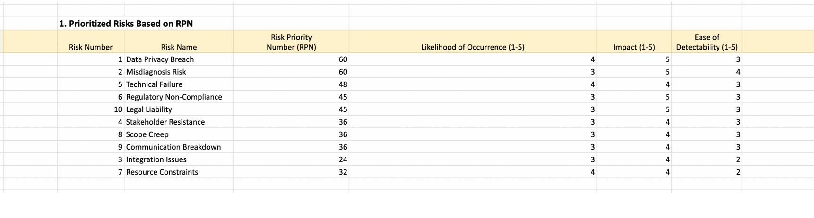
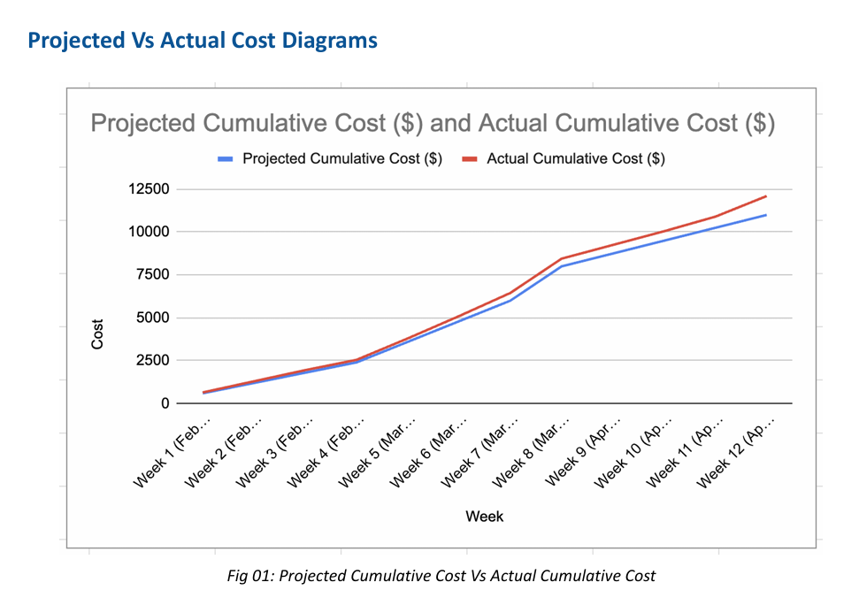
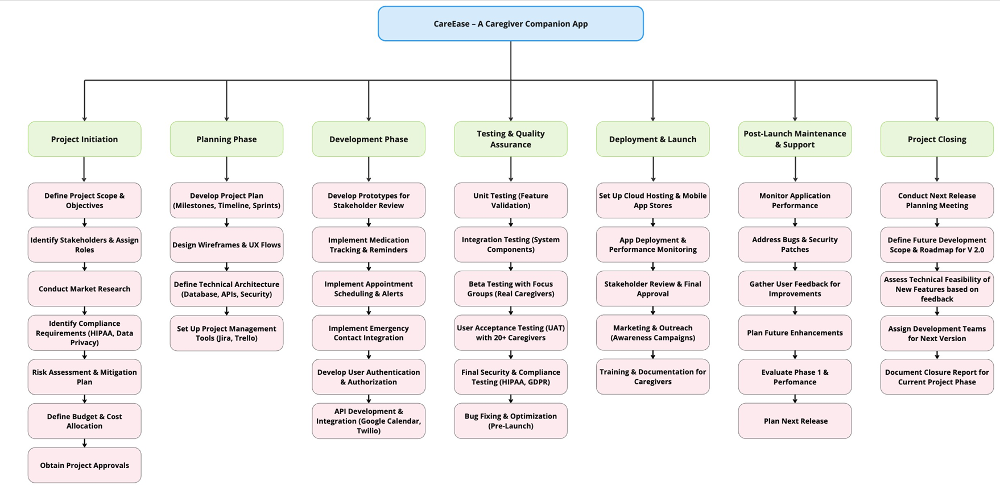

# CareEase - Digital Health Project Management Case Study

## Executive Summary

CareEase is a structured digital health project management case study simulating the development of a caregiver companion app for dementia care. 

This project demonstrates end-to-end project lifecycle planning including risk prioritization (RPN scoring), budget variance tracking, stakeholder communication planning, and workflow modeling.

The focus was on translating healthcare requirements into measurable project governance, cost control, and risk mitigation strategies.
## My Role (Mahitha Gogu)
**Project Analytics / Data Analyst**
## Project Impact

- Applied structured RPN-based risk prioritization
- Conducted projected vs. actual cost variance analysis
- Designed stakeholder communication and governance plan
- Developed phase-based workflow for execution monitoring

## Key Deliverables (PDF)

- [Project Proposal](docs/01-project-proposal.pdf)
- [Scope Statement](docs/02-project-scope-statement.pdf)
- [Risk Analysis](docs/03-risk-analysis.pdf)
- [Communication Management Plan](docs/04-communication-management-plan.pdf)
- [Budget Variance Analysis](docs/05-budget-variance-analysis.pdf)
- [Project Phase Workflow Diagram](docs/06-project-phase-workflow-diagram.pdf)
- [Final Presentation](docs/07-final-presentation.pdf)

## Tools & Methods Used

- Project lifecycle planning
- Risk analysis (RPN scoring)
- Budget variance tracking
- Stakeholder communication planning
- Workflow diagram modeling
- Microsoft Excel
- PowerPoint

## Repository Structure
- `docs/` – Full project documents (PDF)
- `visuals/` – Key figures/screenshots for quick review
- `notes/` – Lessons learned and supporting notes

## Quick Preview

### Risk Prioritization (RPN)

### Budget Variance Tracking

### Project Phase Workflow
